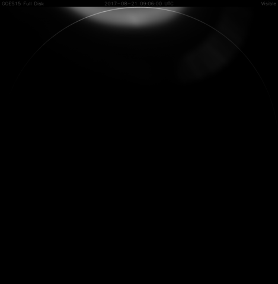

# goestools

Tools to work with signals and files from GOES satellites.

* **goesdec**: Decode demodulated signal into LRIT files.
* **goesproc**: Process LRIT files into plain files and images.

I started writing this to learn about things involved in the GOES
communication pipeline and in the process learn more about space
communication standards. Everything is written in C++ to strike a
balance between usability (no need for yet another hash table in C)
and performance. Eventually it would be nice to run the entire RX
pipeline on a little ARM board.

## Requirements

System dependencies:

* CMake
* C++14 compiler
* OpenCV 2 (for image processing in goesproc)

Bundled dependencies:

* libcorrect (currently a fork with CMake related fixes)
* libaec

## Build

``` shell
git clone https://github.com/pietern/goestools
cd goestools
mkdir -p build
cd build
cmake ../ -DCMAKE_INSTALL_PREFIX=/usr/local
ls ./src/goesdec ./src/goesproc
```

## Usage

### goesdec

Takes as arguments any number of files with raw demodulated
samples. These files are then sorted by their basename to ensure they
are in chronological order even if they are stored at different paths.
It then reads the files in order, as if they were concatenated, and
decodes the samples into LRIT files. LRIT files are organized by their
file type and origin.

For example:

``` shell

$ src/goesdec/goesdec /tmp/signals/goes/demod-2017-09-02T00\:02\:38.raw
Reading from: /tmp/signals/goes/demod-2017-09-02T00\:02\:38.raw
Skipping 2555 bits (max. correlation of 64 at 2555)
Saving ./out/dcs/DCSdat245070234789.lrit (8169 bytes)
Saving ./out/dcs/DCSdat245070239823.lrit (8042 bytes)
Saving ./out/dcs/DCSdat245070239842.lrit (7981 bytes)
...
```

### goesproc

Takes as arguments a number of options followed by a list of files and
directories. File arguments are expected to be LRIT files. Directory
arguments are extrapolated to all files they contain that match the
`*.lrit` pattern. The full list of files is taken under consideration
when producing outputs.

For example:

``` shell
$ build/src/goesproc/goesproc --channel VS ./out/images/goes15/fd
Writing GOES15_FD_VS_20170820-210600 (2712x2773)
Writing GOES15_FD_VS_20170821-000600 (2712x2773)
Writing GOES15_FD_VS_20170821-030600 (2712x2773)
Writing GOES15_FD_VS_20170821-060600 (2712x2773)
Writing GOES15_FD_VS_20170821-090600 (2712x2773)
Writing GOES15_FD_VS_20170821-120600 (2712x2773)
Writing GOES15_FD_VS_20170821-150600 (2712x2773)
Writing GOES15_FD_VS_20170821-180600 (2712x2773)
...
```

You can now use these image files however you like. For example, to
produce a GIF from 8 consecutive full disk images, you can use the
following ImageMagick commands:

``` shell
mogrify -resize '640x480>' *.pgm
convert -loop 0 -delay 50 *.pgm GOES15_FD_VS_20170821.gif
```



## Resources

All PDFs at http://www.noaasis.noaa.gov/LRIT/pdf-files/ are useful, in
particular the receiver specs, transmitter specs, and mission data
documents.

* http://www.noaasis.noaa.gov/LRIT/pdf-files/3_LRIT_Receiver-specs.pdf
* http://www.noaasis.noaa.gov/LRIT/pdf-files/4_LRIT_Transmitter-specs.pdf
* http://www.noaasis.noaa.gov/LRIT/pdf-files/5_LRIT_Mission-data.pdf

Also, these blog series:

* http://www.acasper.org/2011/10/24/goes-satellite-decoding/
* http://www.teske.net.br/lucas/2016/10/goes-satellite-hunt-part-1-antenna-system/

### Reed-Solomon

From the LRIT receiver specs:

> The LRIT dissemination service is a Grade-2 service; therefore, the
> transmission of user data will be error controlled using
> Reed-Solomon coding as an outer code. The used Reed-Solomon code is
> (255,223) with an interleaving of I = 4.

Data must be transformed from Berlekamp's dual basis representation to
conventional representation before we can run the Reed-Solomon
algorithm provided by libcorrect.

Please refer to [CCSDS 101.0-B-6][CCSDS101.0-B-6] (Recommendation For
Space Data System Standards: Telemetry Channel Coding) to read more
about the Reed-Solomon specifics for this application, the dual basis
representation, and how to transform data between conventional
representation and dual basis representation.

[CCSDS101.0-B-6]: https://public.ccsds.org/Pubs/101x0b6s.pdf

## Acknowledgments

Thanks to [@lukasteske](https://twitter.com/lucasteske) for building
an open source demodulator and decoder (see [Open Satellite
Project][OSP]). I used his code to verify my antenna system and as
reference to cross check between the LRIT spec and his implementation.

[OSP]: https://github.com/opensatelliteproject
